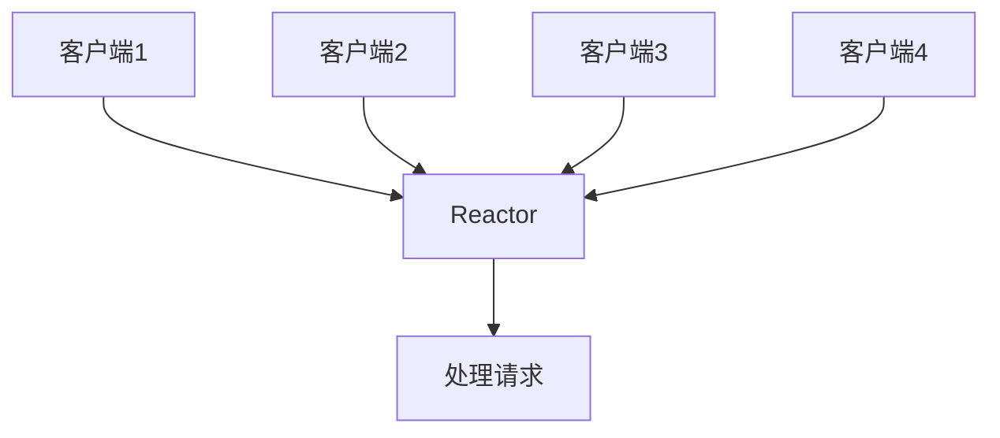
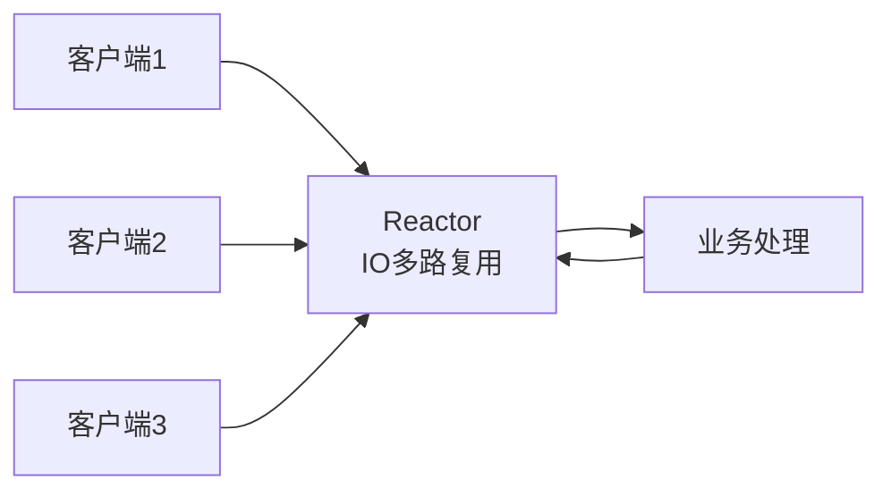
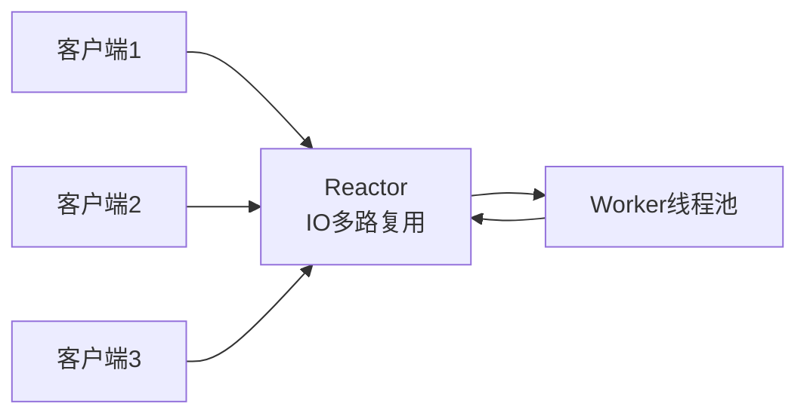
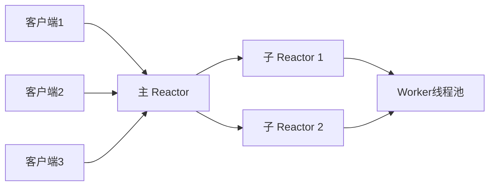
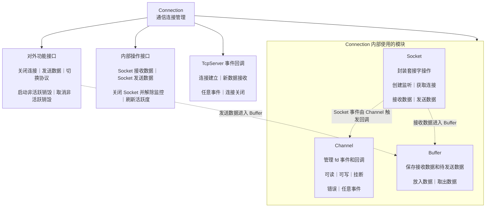
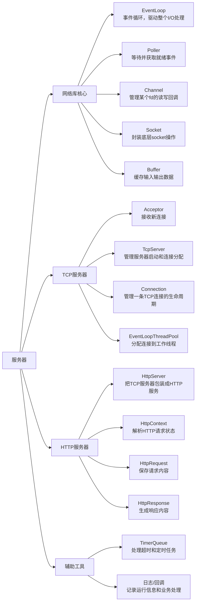

# muduo-otol-concurrent-server
Muduo-inspired C++ high-concurrency server: master-slave Reactor, one-thread-one-loop, with HTTP support.先从了解一下概念开始：
x

## 1. 基础框架

### 1.1 HTTP服务器：

HTTP 是运行在 TCP 之上的应用层协议，本质上采用**客户端请求、服务器响应**的方式进行通信。因此，实现 HTTP 服务器可以简单分为：**搭建 TCP 服务器 → 按 HTTP 格式解析请求 → 根据请求提供服务 → 按 HTTP 格式返回响应**。项目基于 Reactor 模式实现高性能 HTTP 服务器基础库；开发中也推荐直接使用 `httplib` 等现成 HTTP 库，避免从底层自行实现。


### 1.2 Reactor模型：

**利用 I/O 多路复用统一监听多个连接的事件，事件就绪后再分发给对应的处理线程/逻辑进行处理，因此也叫 Dispatcher 模式。**

Linux 下推荐使用 **`epoll`** 做多路复用。相比 `select/poll`，`epoll` **无需每次重复传递和遍历全部 fd，而是通过就绪事件队列直接获取活跃 fd**，连接数很多、但同时活跃连接较少时性能优势尤其明显。



**分类**：

**单Reactor单线程：单I/O多路复用+业务处理**
1. 通过IO多路复用模型进行客户端请求监控
2. 触发事件后，进行事件处理
   - a. 如果是新建连接请求，则获取新建连接，并添加至多路复用模型进行事件监控。
   - b. 如果是数据通信请求，则进行对应数据处理（接收数据，处理数据，发送响应）。

- 优点：所有操作均在同一线程中完成，思想流程较为简单，不涉及进程/线程间通信及资源争抢问题。
- 缺点：无法有效利用CPU多核资源，很容易达到性能瓶颈。
- 适用场景：适用于客户端数量较少，且处理速度较为快速的场景。如果业务处理流程较慢，则后续连接长时间无法得到响应，引发饥饿问题。



**单Reactor多线程：单I/O多路复用+线程池（业务处理）**

1. Reactor线程通过I/O多路复用模型进行客户端请求监控
2. 触发事件后，进行事件处理
   - a. 如果是新建连接请求，则获取新建连接，并添加至多路复用模型进行事件监控。
   - b. 如果是数据通信请求，则接收数据后分发给Worker线程池进行业务处理。
   - c. 工作线程处理完毕后，将响应交给Reactor线程进行数据响应

- 优点：充分利用CPU多核资源
- 缺点：多线程间的数据共享访问控制较为复杂，单个Reactor承担所有事件的监听和响应，在单线程中运行，高并发场景下容易成为性能瓶颈。




**多Reactor多线程：多I/O多路复用+线程池（业务处理）**

1. 在主Reactor中处理新连接请求事件，有新连接到来则分发到子Reactor中监控
2. 在子Reactor中进行客户端通信监控，有事件触发，则接收数据分发给Worker线程池
3. Worker线程池分配独立的线程进行具体的业务处理
   - a. 工作线程处理完毕后，将响应交给Reactor线程进行数据响应

- 优点：充分利用CPU多核资源，主从Reactor各司其职
- 总结概括：主 Reactor 管连接，子 Reactor 管 IO，线程池管业务。


> **注意：线程并不是越多越好。** 如果业务处理本身较轻，没必要额外引入线程池，否则会增加线程调度、上下文切换以及线程间通信的开销。因此，本项目不单独增加 Worker 线程池，而是直接在 **Reactor 线程中完成 IO 处理和业务处理**，在保证流程简单的同时减少额外的并发开销。

### 1.3 功能模块


#### One Thread One Loop

**One Thread One Loop**：即一个线程对应一个事件处理的循环。当前实现中，因为并不确定组件使用者的使用意向，因此并不提供业务层线程池的实现。只实现主Reactor，而Worker工作线程池，可由组件库的使用者根据是否使用和实现。

#### 功能模块划分

整个项目分为两个大的模块：

- **SERVER模块**：实现Reactor模型的TCP服务器；
- **协议模块**：对当前的Reactor模型服务器提供应用层协议支持。

#### SERVER模块

SERVER模块就是对所有的连接以及线程进行管理，让它们各司其职，在合适的时候做合适的事，最终完成高性能服务器组件的实现。

而具体的管理也分为三个方面：

- **监听连接管理**：对监听连接进行管理。
- **通信连接管理**：对通信连接进行管理。
- **超时连接管理**：对超时连接进行管理。

---

可以划分为以下多个子模块：

#### Buffer模块

Buffer模块是一个缓冲区模块，用于实现通信中用户态的接收缓冲区和发送缓冲区功能。**TCP 只保证“字节流”**，不保证一次收到的就是一整条消息。

Buffer 的作用主要有 4 个：

1. **解决半包、粘包**
   - 一次 `read()` 可能只读到半个请求
   - 也可能一次读到多个请求
   - Buffer 把零散数据先攒起来，等拼完整再交给上层

2. **把网络 I/O 和业务处理解耦**
   - 读事件来了，不代表业务马上就能处理
   - 先进入 Buffer，后面再按协议解析成 HTTP 请求、消息包之类的内容

3. **支持写缓冲**
   - `write()` 也不一定一次写完
   - Buffer 可以把没写完的数据先存住，等下次可写事件再继续发

4. **提高效率**
   - 避免频繁小内存分配
   - 减少 `read/write` 的零碎操作
   - 更适合高并发服务器


#### Socket模块

负责完成对底层套接字接口的封装，主要有这几个作用：

1. **封装系统接口**
   - 像 `socket / bind / listen / accept / connect / shutdown` 这些都很底层
   - 单独封装后，上层不用直接碰一堆系统调用

2. **统一管理 fd**
   - socket 本质上就是一个文件描述符
   - 模块化以后，创建、关闭、复用、设置属性都更清楚

3. **设置连接参数**
   - 比如地址复用、Nagle 相关选项、保持连接、非阻塞等
   - 这些都是服务器必须处理的底层细节

4. **给上层模块提供稳定接口**
   - `Acceptor` 需要监听 socket
   - `Connection` 需要读写 socket
   - 上层只关心“怎么用”，不关心底层系统细节


#### Channel模块

Channel模块是对一个描述符需要进行的IO事件管理的模块，实现对描述符可读，可写，错误事件的管理操作，以及Poller模块对描述符进行IO事件监控就绪后，根据不同的事件，回调不同的处理函数功能。下面是主要功能：

1. **绑定一个 fd**
   - 比如 socket、listen fd、连接 fd
   - 一个 fd 通常对应一个 Channel

2. **记录这个 fd 关心什么事件**
   - 可读
   - 可写
   - 关闭
   - 错误

3. **保存事件回调**
   - 读事件来了，调用读回调
   - 写事件来了，调用写回调
   - 出错或关闭时，也走对应回调


#### Connection模块

Connection模块是对Buffer模块，Socket模块，Channel模块的一个整体封装，实现了对一个通信套接字的整体的管理，进行数据通信的套接字使用Connection进行管理。下面是该模块包含的内容：

- 组件使用者可以传入的回调函数：连接建立完成回调，事件进行时回调，新数据回调，关闭回调。

- 两个组件使用者提供的接口：数据发送接口，连接关闭接口
- 两个用户态缓冲区：用户态接收缓冲区，用户态发送缓冲区
- 一个Socket对象：完成描述符面向系统的IO操作
- 一个Channel对象：完成描述符IO事件就绪的处理


简单一点理解作用：
1. **管理一条连接**
   - 每个 `accept` 到的新连接，都会交给一个 `Connection` 管，它代表“客户端和服务端之间这一次会话”

2. **把底层模块串起来**
   - 里面有 `Socket`、 `Channel`、两个 `Buffer`，所以它是 `Buffer + Socket + Channel` 的整体封装

3. **负责读写流程**
   - 读数据：socket 收到字节流，先放进接收缓冲区
   - 写数据：业务层把数据放进发送缓冲区，再由 socket 发出去

4. **负责连接状态和关闭**
   - 连接建立
   - 收到新数据
   - 数据发送完成
   - 连接关闭
   - 协议切换（回调函数切换）
   - 启动/取消非活跃连接超时释放

具体处理流程如下：

1. 实现向Channel提供可读，可写，错误等不同事件的IO事件回调函数，然后将Channel和对应的描述符添加到Poller事件监控中。
2. 当描述符在Poller模块中就绪了IO可读事件，则调用描述符对应Channel中保存的读事件处理函数，进行数据读取，将socket接收缓冲区全部读取到Connection管理的用户态接收缓冲区中。然后调用由组件使用者传入的新数据到来回调函数进行处理。
3. 组件使用者进行数据的业务处理完毕后，通过Connection向使用者提供的数据发送接口，将数据写入Connection的发送缓冲区中。
4. 启动描述符在Poller模块中的IO写事件监控，就绪后，调用Channel中保存的写事件处理函数，将发送缓冲区中的数据通过Socket进行面向系统的实际数据发送。





---

#### Acceptor模块


Acceptor模块是对Socket模块，Channel模块的一个整体封装，实现了对一个监听套接字的整体的管理。其内部包含有：

- 一个Socket对象：实现监听套接字的操作
- 一个Channel对象：实现监听套接字IO事件就绪的处理

具体处理流程如下：

1. 实现向Channel提供可读事件的IO事件处理回调函数，函数的功能其实也就是获取新连接
2. 为新连接构建一个Connection对象出来：监听 socket 可读 -> Acceptor 调用 accept() -> 得到新 fd -> 创建 Connection


注意这里的channel要和Connection中的channel区别开来：
1. `Acceptor` 里的 `Channel`它监听的是**监听 socket**。

- 这个 socket 先 `listen()`
- 当有新连接到来时，它会变成“可读”
- `Channel` 检测到可读事件后
- 回调 `Acceptor::handleRead()`
- 然后在里面调用 `accept()`

**`Acceptor` 中的 `Channel` 负责监听到新连接事件后，回调 `accept`。**

2. `Connection` 里的 `Channel`它监听的是**accept 成功后得到的已连接 socket**。

- 这个 fd 代表一条真正建立好的 TCP 连接
- 后续客户端发数据、服务端可写、连接关闭等
- 都靠这个 `Channel` 去触发对应回调

**`Connection` 中的 `Channel` 负责后续读写和关闭等回调。**

#### TimerQueue模块
TimerQueue模块是实现固定时间定时任务的模块，向定时任务管理器中添加一个任务，任务将在固定时间后被执行，同时也可以重新设置定时任务来延迟任务的执行。

这个模块对Connection对象的生命周期管理，对非活跃连接进行超时后的释放，其中包含有：

- 一个timerfd：linux系统提供的定时器。
- 一个Channel对象：实现对timerfd的IO时间就绪回调处理

#### Poller模块：
Poller模块是对epoll进行封装的一个模块，实现epoll的IO事件添加，修改，移除，获取活跃连接功能，主要有以下功能：

1. **注册 fd 到事件监控里**
   - 把 `Channel` 关心的事件交给底层系统，比如读事件、写事件

2. **修改监听事件**
   - 某个连接现在不想监听写了，就把写事件去掉，某个 fd 状态变了，就更新监控内容

3. **删除 fd 监听**
   - 连接关闭后，从事件集合里移除

4. **等待就绪事件**
   - 调用 `epoll_wait` 之类的接口阻塞等待，一旦有事件发生，把“活跃的 Channel”返回给上层，接下来就是调用对应的回调函数。

#### EventLoop模块

一个从Reactor对应一个EventLoop，作用：**管理一个线程，持续等待和分发该线程负责的网络事件**。

分配过程通常是：

1. 主 Reactor 通过监听 fd 发现有新连接。
2. `Acceptor` 调用 `accept` 得到新的连接 fd。
3. 主 Reactor 选择一个从 Reactor。
4. 主 Reactor 把“注册这个连接 fd”的任务放入该从 Reactor 的任务队列。
5. 通过 `wakeup` 唤醒从 Reactor。
6. 从 Reactor 在线程内部执行任务，把 fd 注册到自己的 `epoll`。
7. 之后这个连接的读写和业务处理都由该从 Reactor 负责。

由于**一个连接分配给一个从 Reactor 后，通常一直由它负责，不会频繁转移。**，可以避免线程安全问题：

- 多个线程同时操作同一个 `Connection`。
- 多个线程同时读写同一个 `Buffer`。
- 一个线程修改 `Channel`，另一个线程同时处理它的事件。
- 多个线程同时向同一个连接注册或注销 fd。

EventLoop 包含：

1. `Poller`：通过 `epoll` 监控多个 fd。
2. `eventfd`：用于唤醒阻塞中的 `epoll_wait`。
3. `Channel`：管理 `eventfd` 等 fd 的事件和回调。
4. `TimerQueue`：管理定时任务。
5. `PendingTask` 队列：对Connection进行的所有操作，都加入到任务队列中，在EventLoop对应的线程中进行执行。
6. 每一个Connection对象都会绑定到一个EventLoop上。

```plain
一个从 Reactor
    └── 一个 EventLoop
            ├── Connection 1（fd1）
            ├── Connection 2（fd2）
            └── Connection 3（fd3）
```
具体操作流程：

1. 通过Poller模块对当前模块管理内的所有描述符进行IO事件监控，有描述符事件就绪后，通过描述符对应的Channel进行事件处理。
2. 所有**就绪的描述符IO事件处理完毕后**，对任务队列中的所有操作顺序进行执行。
3. 由于epoll的事件监控，有可能会因为没有事件到来而持续阻塞，导致任务队列中的任务不能及时得到执行，因此创建了eventfd，添加到Poller的事件监控中，用于实现每次**向任务队列添加任务的时候，通过向eventfd写入数据来唤醒epoll的阻塞。**

#### TcpServer模块：
主要工作在主Reactor中，内部封装了Acceptor模块，EventLoopThreadPool模块。包含以下：

- 一个EventLoop对象：以备在超轻量使用场景中不需要EventLoop线程池，只需要在主线程中完成所有操作的情况。
- 一个EventLoopThreadPool对象：EventLoop线程池（子Reactor线程池）
- 一个Acceptor对象：一个TcpServer服务器，必然对应有一个监听套接字，能够完成获取客户端新连接，并处理的任务。

- TcpServer模块内部包含有一个`std::shared_ptr<Connection>`的hash表：保存了所有的新建连接对应的Connection，注意，所有的Connection使用shared_ptr进行管理，这样能够保证在hash表中删除了Connection信息后，在shared_ptr计数器为0的情况下完成对Connection资源的释放操作。

主要功能有：

1. **监听连接的管理**
负责客户端新连接的接入处理，获取新连接之后的处理逻辑由TcpServer模块统一设置，完成新连接的接收、初始化与分配。

2. **通信连接的管理**
管控所有已建立通信的连接，连接产生的各类IO事件（读事件、写事件等）的处理规则，由TcpServer模块统一配置。

3. **超时连接的管理**
负责连接的健康状态管理，连接非活跃超时后是否关闭、资源是否回收的策略，由TcpServer模块设置，避免非活跃连接占用服务器资源。

4. **事件监控的管理**
负责底层事件循环的资源调度，服务器启动多少个线程、创建多少个EventLoop事件循环，都由TcpServer进行配置。

5. **事件回调函数的设置**
事件处理回调由使用者配置给TcpServer，再由TcpServer下发给每一个Connection连接。

具体操作流程如下：

1. 在实例化TcpServer对象过程中，完成BaseLoop的设置，Acceptor对象的实例化，以及EventLoop线程池的实例化，以及`std::shared_ptr<Connection>`的hash表的实例化。
2. 为Acceptor对象设置回调函数：获取到新连接后，为新连接构建Connection对象，设置Connection的各项回调，并使用shared_ptr进行管理，并添加到hash表中进行管理，并为Connection选择一个EventLoop线程，为Connection添加一个定时销毁任务，为Connection添加事件监控，
3. 启动BaseLoop。


项目总体模块架构：


